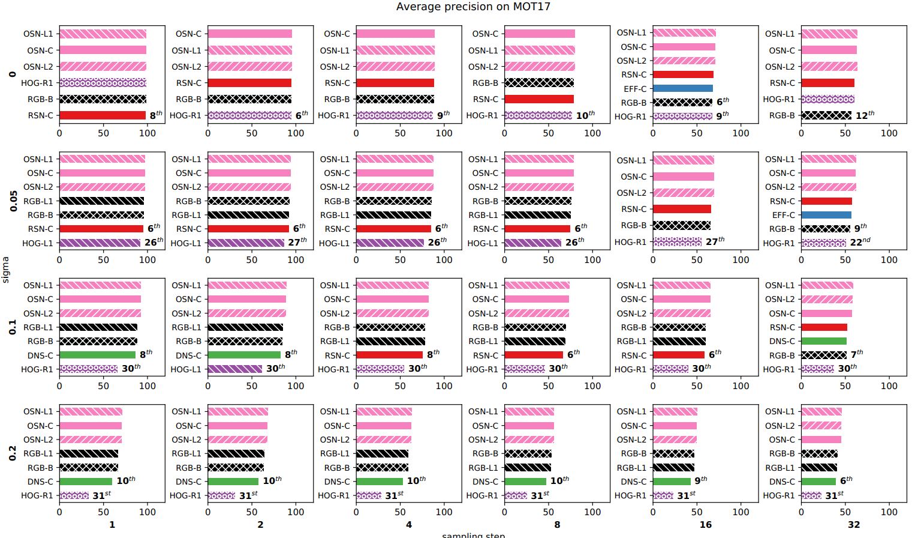
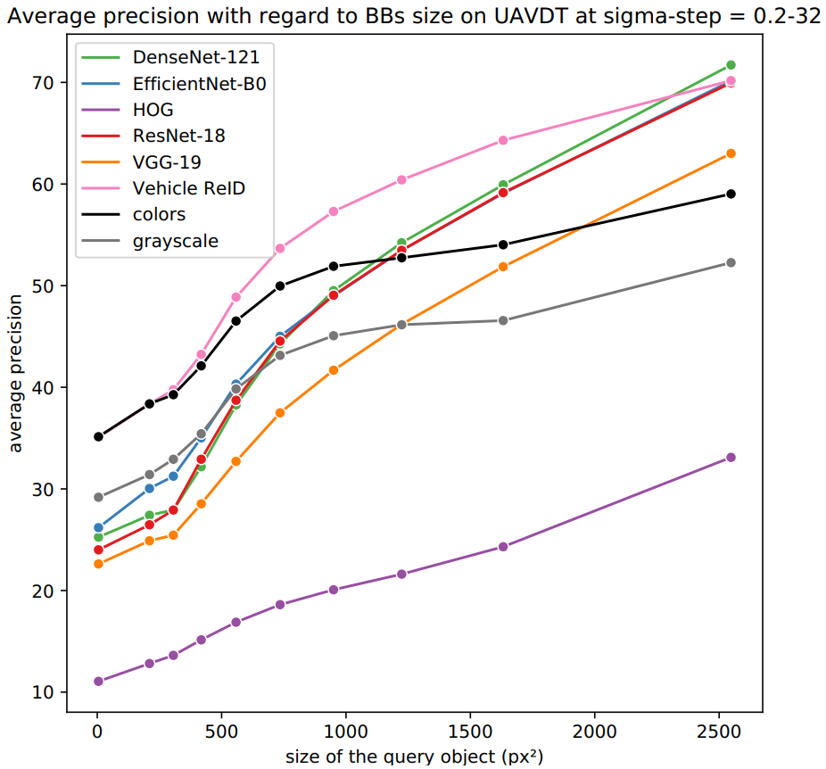

# An Empirical Analysis of Visual Features for Multiple Object Tracking in Urban Scenes
**Authors : Mehdi Miah, Justine Pépin, Nicolas Saunier & Guillaume-Alexandre Bilodeau** <br>
*Polytechnique Montréal - 2020*

[[Project page](https://mehdimiah.com/visual_features.html)] [arXiv] [ICPR paper]


## Objective

Rank visual features for multiple object tracking focused on urban scenes

## Installation

### Requirements

Linux and Windows supported. Python 3.6, Pytorch 1.4, CUDA 10.0

### Clone repositories

``cd src`` <br>
``git clone https://github.com/KaiyangZhou/deep-person-reid.git (torchreid 1.2.7)`` <br>
``mv deep-person-reid/ deep_person_reid/`` <br>
``pip install efficientnet_pytorch`` <br>
``git clone https://github.com/cw1204772/AIC2018_iamai.git``

### Datasets

You can download the following datasets :
- WildTrack : [https://www.epfl.ch/labs/cvlab/data/data-wildtrack/](https://www.epfl.ch/labs/cvlab/data/data-wildtrack/)
- MOT17 : [https://motchallenge.net/data/MOT17/](https://motchallenge.net/data/MOT17/)
- DETRAC : [http://detrac-db.rit.albany.edu/](http://detrac-db.rit.albany.edu/)
- UAVDT : [https://sites.google.com/site/daviddo0323/projects/uavdt](https://sites.google.com/site/daviddo0323/projects/uavdt)

Change the path to data in the file ``./src/dataset.py``.

### Weights

The weights for VGG-19, ResNet-18, DenseNet-121 come from Pytorch.

The weights for Efficient-B0 come from ``efficientnet_pytorch`` (automatically downloaded).

The weights for pedestrian ReID come from [deep-person-reid](https://kaiyangzhou.github.io/deep-person-reid/MODEL_ZOO.html#market1501-dukemtmc-reid)

The weights for vehicles ReID come from [AIC2018_iamai](https://github.com/cw1204772/AIC2018_iamai#demo)


### Final structure of files

```bash
.
├─── doc
├─── results
│   ├─── figure
|   ├─── logs
├─── src
|   ├─── affinity.py
|   ├─── analysis_rank.py
|   ├─── analysis_size.py
|   ├─── appearances.py
|   ├─── dataset.py
|   ├─── main.py
|   ├─── utils.py
|   ├─── AIC2018_iamai
|   ├─── deep_person_reid
├─── weights
|   ├─── model_880_base.ckpt
|   ├─── osnet_ain_x1_0_market1501_256x128_amsgrad_ep100_lr0.0015_coslr_b64_fb10_softmax_labsmth_flip_jitter.pth
```

## Run experiments

Compute the mean average precision on a specific scene with a chosen features and sigma : 

``
python main.py --dataset="DETRAC" --scene="20011" --feature="resnet18" --sigma=10
``

Analyze the ranking of features on a specific dataset  :

``
python analysis_rank.py --dataset="DETRAC"
``

Analyze effect of the size on features on a specific dataset :

``python analysis_size.py --dataset="DETRAC"
``

## Results

      

## Citation and acknowledgment

If you refer to this work, please cite :

```bibtex
@inproceedings{miah2020empirical,
    title = {An {Empirical} {Analysis} of {Visual} {Features} for {Multiple} {Object} {Tracking} in {Urban} {Scenes}},
    author = {Miah, Mehdi and Pépin, Justine and Saunier, Nicolas and Bilodeau, Guillaume-Alexandre},
    booktitle = {International {Conference} on {Pattern} {Recognition} ({ICPR})},
    year = {2020}
}
```

We acknowledge the support of the Natural Sciences and Engineering Research Council of Canada (NSERC), [CRDPJ 528786 - 18], [DG 2017-06115] and the support of Arcturus Networks.
